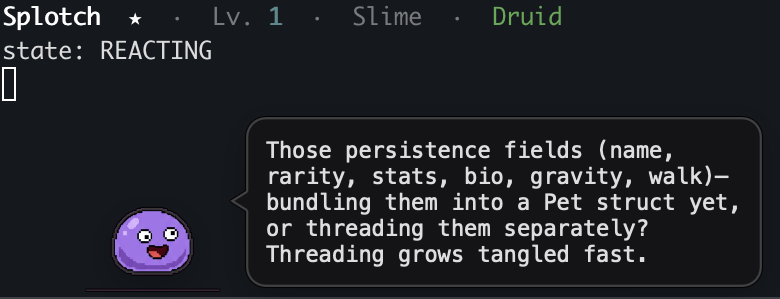

# Claude Companion

A cross-platform desktop companion that watches your Claude Code
sessions and reacts in-character for macOs and linux.



## Setup

```bash
# 1. Install (puts `companion` on your PATH).
#    --editable picks up source edits without reinstalling.
uv tool install --editable .

# 2. Set your API keys in <config>/.env or in your environment vars
#    GEMINI_API_KEY=…   # for sprite-sheet generation

# 3. Create a companion (interactive)
companion new

# 4. Generate its sprite art
companion art

# 5. Run
companion
```

`<config>` defaults to `~/.config/claude-code-assist/`.

When you change dependencies (`pyproject.toml`), refresh the tool env:
`uv tool install --editable . --reinstall`.

## Other commands

```bash
companion roster    # list / switch active companion
companion levelup   # force a level-up (debug; skips eligibility)
```


